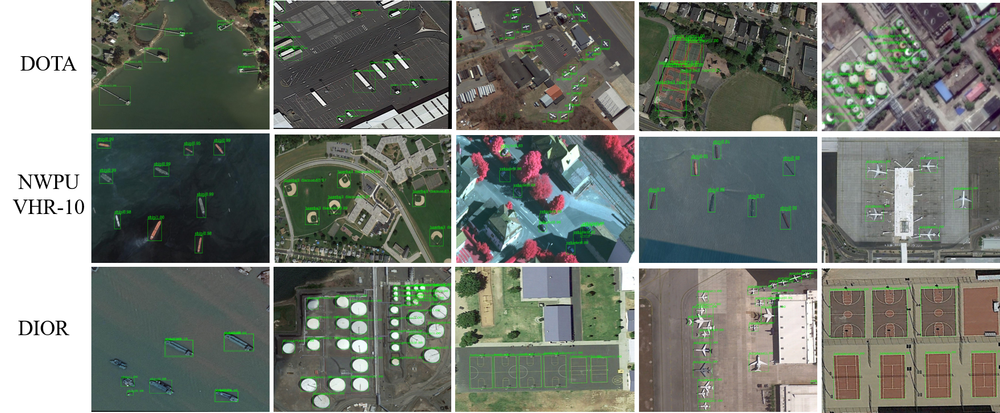

# Global to Local: Clip-LSTM based Object Detection from Remote Sensing Images


This repository provides the test code of our paper Global to Local: Clip-LSTM based Object Detection from Remote Sensing Images.


Object detection from Remote Sensing Images(RSIs) is a basic topic in the area of aviation and satellite image processing, which has great effects on geological disaster detection, agricultural planning, and land utilization. However,it is always faced with several severe difficulties. For instance,the scale of the target spans over a very wide range, and the difference between the target size and the image size is huge, as some targets only account for a dozen pixels compared with the remote sensing image of the megapixel level. In this work, an innovative object detection network (GLNet) integrating clip-LSTM is proposed for remote sensing imagery. Our approach integrates global context clues extracted by multi-scale perception subnetwork (MSPNet) and local spatial contextual correlations encoded by the clip-LSTM. These rich semantic features are further exploited to design a self-adapted anchor subnetwork (SANet) to alleviate the scale variations in RSIs. Extensive experiments are executed on several public easilyaccessed benchmarks, including DOTA, NWPU VHR-10, and
DIOR. Experimental results have demonstrated that our GLNet outperforms numerous latest methods.

## Installation

1. Clone and enter this repository:

```
https://github.com/Zhu1Teng/GLNet.git
```

2. Download dataset
    Please download [Nwpu vhr-10](https://drive.google.com/file/d/1kcihENWlcEwTV0tXYLEjrjS1YhE-BaWy/view?usp=sharing), Dior and unzip them in the `data` folder.

3. Download model
    Please download [all model](https://drive.google.com/drive/folders/1NkaYV5wo_9jlONgJwQi0sy82XuVfXzV6?usp=sharing) and put them in the `model` folder.

## Do evaluate

Before the evaluation, we need to change the configuration information in `config.py`, and change the configuration  to the corresponding dataset we need.

The following is the configuration file content of Nwpu vhr-10

```
dataset_type = 'VOCDataset'
data_root = 'data/NWPU VHR-10 datasetVOC2007/'

img_norm_cfg = dict(
    mean=[123.675, 116.28, 103.53], std=[58.395, 57.12, 57.375], to_rgb=True)
data = dict(
    imgs_per_gpu=1,
    workers_per_gpu=2,
    test=dict(
        type=dataset_type,
        ann_file=data_root + 'test.txt',
        img_prefix=data_root + 'positive image set test/',
        img_scale=(800, 800),
        img_norm_cfg=img_norm_cfg,
        size_divisor=32,
        flip_ratio=0,
        with_mask=False,
        with_label=False,
        test_mode=True))
```

Run evaluate

```
python voc_eval.py models/NW-model.pkl config.py
```

## Result



<br />
<center>Our performance on the DOTA dataset</center>

|Dataset	| P    | S    | ST   | BD   | TC   | BC   | GTF  | H    | B    | SV   | LV   | SBF  | RA   | SP   | HC   | MAP| 
|  ----         | ---- | ---- | ---- | ---- | ---- | ---- | ---- | ---- | ---- | ---- | ---- | ---- | ---- | ---- | ---- | ---- |
|DOTA | 89.4 | 53.9 | 77.2 | 71.5 | 79.9 | 66.9 | 68.4 | 73.1 | 43.1 | 31.9 | 52.5 | 74.1 | 64.6 | 59.2 | 74.0 |65.3|

<br />

<center>Our performance on the NWPU VHR-10 dataset</center>

|Dataset    | airplane | storage tank | baseball diamond | tennis court | basketball court | ground track field | harbor | bridge | vehicle | shi | mAP|
|  ----      | ----    | ----         | ----             | ----         |             ---- |               ---- | ----   | ----   | ----    | ----| ---- |
| NWPU VHR-10|100      | 84.4         | 98.5           | 81.6              | 88.2          | 100                | 97.2   | 88.4  | 90.9  | 88.7 | 91.8 |


<br />


<center>Our performance on the DIOR dataset</center>
<table>
	<tr>
	    <td rowspan="2">Dataset</td>
	    <td>airplane</td>
	    <td>airport</td>
	    <td>stadium</td>
	    <td>ship</td>
	    <td>bridge</td>
	    <td>dam</td>
	    <td>chimney</td>
	    <td>harbor</td>
	    <td>overpass</td>
	    <td>vehicle</td>
	    <td rowspan="2">MAP</td>  
	</tr >
	<tr >
	    <td>ground track field</td>
	    <td>express way service area</td>
	    <td>express way toll station</td>
	    <td>basketball court</td>
	    <td>baseball field</td>
	    <td>storage tank</td>
	    <td>tennis court</td>
	    <td>train station</td>
	    <td>golf course</td>
	    <td>wind mill</td>
	</tr>
	<tr>
	    <td rowspan="2">DIOR</td>
	    <td>62.9</td>
	    <td>83.2</td>
	    <td>75.3</td>
	    <td>72.0</td>
	    <td>50.5</td>
	    <td>67.4</td>
	    <td>79.3</td>
	    <td>51.8</td>
	    <td>62.6</td>
	    <td>43.4</td>
	    <td rowspan="2">70.7</td>
	</tr>
	<tr>
	    <td>83.0</td>
	    <td>86.2</td>
	    <td>70.9</td>
	    <td>81.1</td>
	    <td>72.0</td>
	    <td>53.7</td>
	    <td>81.3</td>
	    <td>65.5</td>
	    <td>81.8</td>
	    <td></td>
	</tr>
</table>
